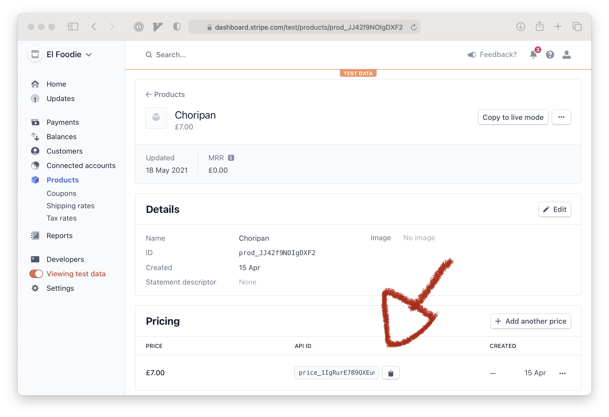

+++
draft = true
slug = "contactless-pos"
title = "Contactless payments with iOS Shortcuts, Stripe, and Serverless Functions"
date = "2021-05-19"
+++

What do you do if you need to take contactless card payments in person, but don’t have a point of sale?

You build one.

<div style="padding:56.25% 0 0 0;position:relative;"><iframe src="https://player.vimeo.com/video/554943818?badge=0&amp;autopause=0&amp;player_id=0&amp;app_id=58479" frameborder="0" allow="autoplay; fullscreen; picture-in-picture" allowfullscreen style="position:absolute;top:0;left:0;width:100%;height:100%;" title="stripe checkout as a pos"></iframe></div><script src="https://player.vimeo.com/api/player.js"></script>

My best friend and I are in the business of [delivering choripanes](https://choripan.delivery)  from our grill to your door—but for one weekend, we wanted to take them directly to the people.

We checked the forecast and spotted—due in 5 days, on a Saturday—the first predicted sunny day in a while. This would also be the first weekend Londoners could have social gatherings outside since the third Covid-19 lockdown. Perfect alignment!

Our kitchen is online only so we’ve never had a reason to own a physical PoS. We thought about ordering one for the weekend, but it looked unlikely that we’d receive any in time.

A distinguishing advantage of ours is that we're vertically integrated. Taking inspiration from [Crave Cookie](https://www.indiehackers.com/product/crave-cookie), we built our own checkout, delivery tracking, and operations software to keep costs low and margins high. That means we have a bunch of software on hand to play with.

So, we pieced together a PoS using the tools already in our toolbox: Stripe, Cloudflare, and our iPhones.

## Tool one: Stripe

Our checkout is optimised for our online order flow, it wasn’t going to be useful to us in the physical world. Instead of hacking changes onto what existed, we opted to use [Stripe Checkout](https://stripe.com/docs/payments/checkout) to relieve the burden of creating a throwaway experience. For those not in the know:

> Checkout creates a secure, Stripe-hosted payment page that lets you collect payments quickly. It works across devices and can help increase your conversion
>
> — <cite>https://stripe.com/docs/payments/checkout</cite>

Integrating Checkout is a little easier if used alongside Stripe's [Prices API](https://stripe.com/docs/api/prices).

The only thing to do in this step is open Stripe's [dashboard](https://dashboard.stripe.com), create a new product and set a price. The price ID will be used later when creating the checkout session.



## Tool two: Serverless Functions

Checkout requires the customer be redirected via a client-side javascript call to `redirectToCheckout`. That means we can't send the customer to the checkout in a single step; we have to use an intermediary webpage that will perform the redirect.

Rather than add another route to our application's router, hook up a redirect page, cut a release, and deploy to our servers, we decided to use our first serverless function.

We already host our DNS with Cloudflare—using their serverless function service, [workers](https://blog.cloudflare.com/cloudflare-workers-unleashed/), made sense for us.

### Creating the worker project

Download [wrangler](https://github.com/cloudflare/wrangler)— Cloudflare's CLI application for managing workers.

Create a workers project

```wrangler init && cd worker```

### Configuration

The worker will need to know your:

* Cloudflare account ID
* Cloudflare zone ID
* Stripe API key

Configure both production and test environments so that you can take your integration for a spin before going out into the real world.

```toml
# wrangler.toml
name = "checkout-session-dev"
type = "javascript"
account_id = "your_cloudflare_account_id"
workers_dev = true
route = ""
zone_id = "your_cloudflare_zone_id"
usage_model = ""
vars = { STRIPE_API_KEY = "pk_test_abcxyz..." }

[env.prod]
name = "checkout-session"
vars = { STRIPE_API_KEY = "pk_live_abcxyz..." }
```

### The Worker itself

The worker is a simple HTML page with an embedded script that pulls your Stripe API key from the workers environment then redirects the customer to the checkout session found in the `session_id` query parameter.

```javascript
// index.js
function html(session_id) {
  return `<!DOCTYPE html>
  <body>
    <h1>Redirecting</h1>
    <p>This shouldn't take long...</p>
    <script src="https://js.stripe.com/v3/"></script>
    <script>
        var stripe = Stripe("${STRIPE_API_KEY}");
        stripe.redirectToCheckout({ sessionId: "${session_id}" });
    </script>
  </body>`
}

/**
 * worker API
 */
addEventListener('fetch', event => {
  event.respondWith(handleRequest(event.request))
})

async function handleRequest(request) {
  const { searchParams } = new URL(request.url)
  const session_id = searchParams.get('session_id')

  return new Response(html(session_id), {
    headers: {
      "content-type": "text/html;charset=UTF-8",
    },
  })
}
```

### Deploying the worker

Publish both versions of your worker at once

`wrangler publish && wrangler publish --env=prod`

## Tool three: iOS Shortcuts

We have our product, and we have the mechanism to load the checkout—let's use [iOS Shortcuts](https://apps.apple.com/us/app/shortcuts/id915249334) to glue them together.

As far as shortcuts go, this one is simple:

* A dictionary for some configuration values;
* Ask for quantity of your product;
* Create a Checkout session;
* Construct a URL: `webhook + session_id`;
* Turn the result into a QR code.


[Get the shortcut](https://www.icloud.com/shortcuts/411cf26e37ea477da8d81be32f0a1ac6), or follow along to create it yourself.


1. First up is the dictionary. Add a `Dictionary` action with the keys `api_key`, `price_id`, and `worker_url` and set their values. Use your test values for now.

1. Then comes input. Add a new `Ask for Input` action, set the type to `Number`, and the prompt to `How many?`

1. Now a `Get Contents of URL` action. The URL should be `https://api.stripe.com/v1/checkout/sessions`
	* Expand "Show More"
	* Set `Method` to `POST`
	* Add an `Authorization` header with the value `Bearer ${api_key}`, where `${api_key}` references the key in the dictionary
	* Add a request body with the type `Form`
	* Add `success_url` pointing towards your landing page
	* Add `cancel_url` pointing anywhere you want (* I recommend  your `/404` or something you don't control like `https://google.com` *)
	* Add `payment_method` set to `card`
	* Add `mode` set to `payment`
	* Add `line_items[0][price]` set to `$price_id`, referencing the price in the dictionary
	* Add `line_items[0][quantity]` set to `Provided Input`, where `Provided Input` is the output from the `Ask for Input` action

1. Add a  `Get Dictionary Value` action, set `Key` to `id`, and leave `Contents of URL` alone

1. Add a `Generate QR Code` action, set the value to be `${worker_url}?session_id=${dictionary_value}`, where `${worker_url}` references the url in the dictionary, and `${dictionary_value}` is the output from the previous action. (Tap the magic wand to highlight output variables)

1. Last action‚ `Show Notification`. Set the value to the output of the `Generate QR Code` action. You may need to use the magic wand prompt again.

Run your action to see it play out. When the notification appears, you need to swipe down to expand—this is what you'll ask your customer to scan with their camera.

Grab a friend or second phone and test the payment.

When you've confirmed everything works, change the dictionary values to your production equivalents

\* *I recommend a `404` or page you don't own for the `cancel_url` so you know the payment failed. If your customer can show you your own landing page after payment, you know it was successful.*

## Wrap Up

In the end we had a successful day. The weather turned out perfect, and the parks were packed as we had hoped. We sold choripan, made friends, and brought more attention to our brand. Our PoS solution worked wonderfully, even turning a few  heads when people expected us to be a cash-only operation.

## One last thing

We actually went a step further and set up Stripe webhooks with Zapier and Slack for real-time notifications, but in the end they weren't useful for us. The landing page was enough confirmation to hand over the goods.
